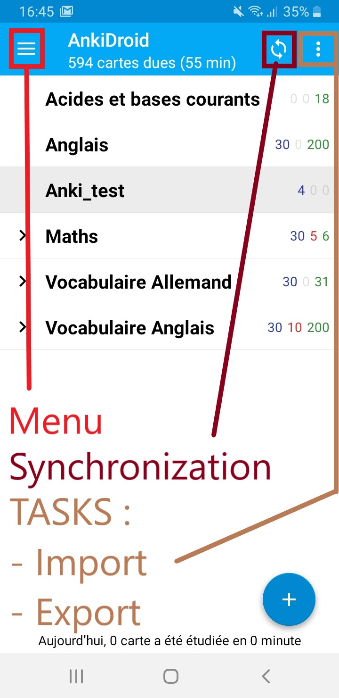
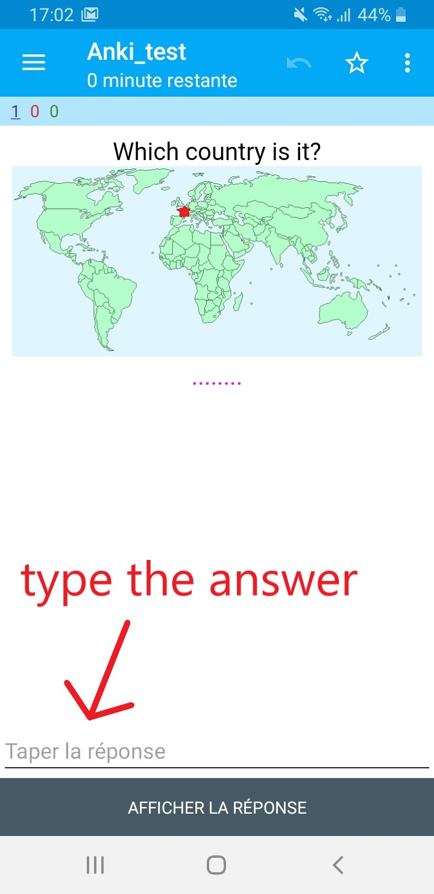
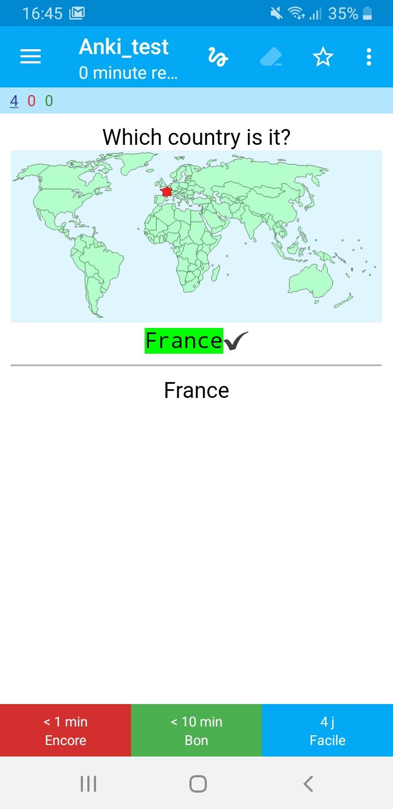
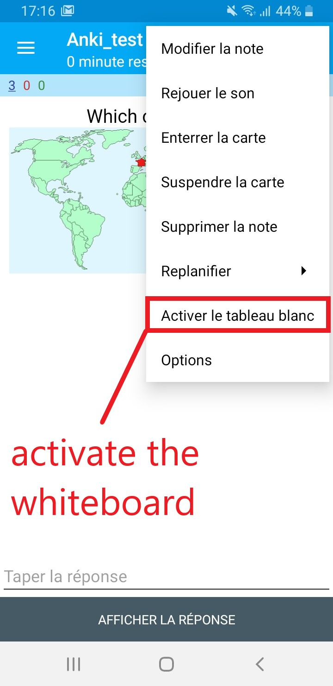
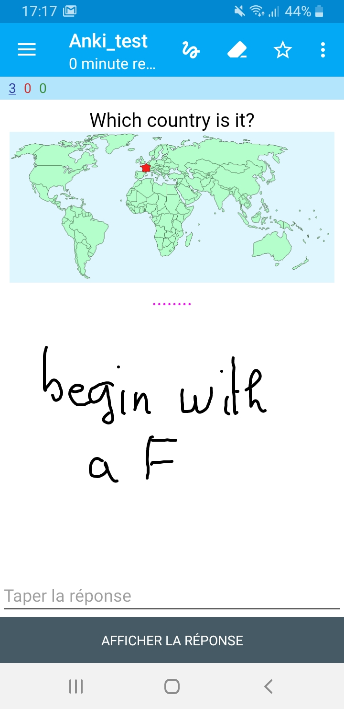
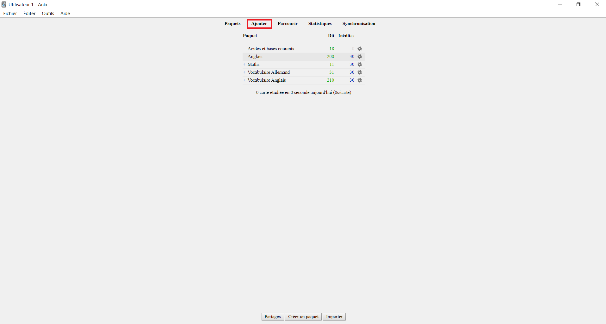
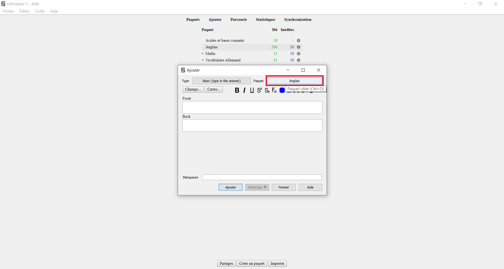
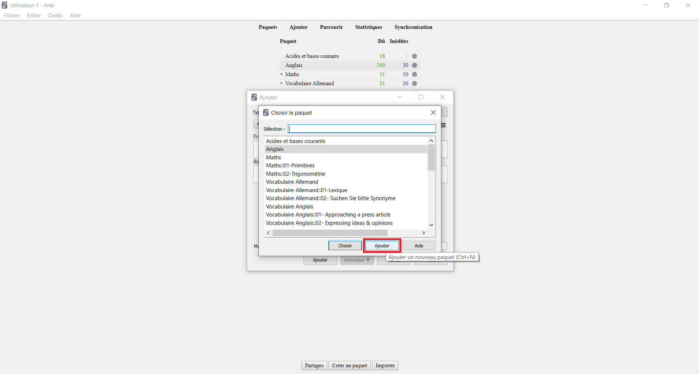
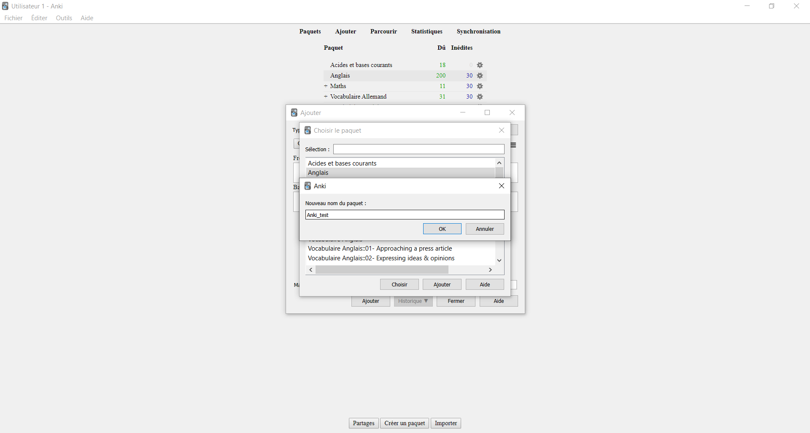
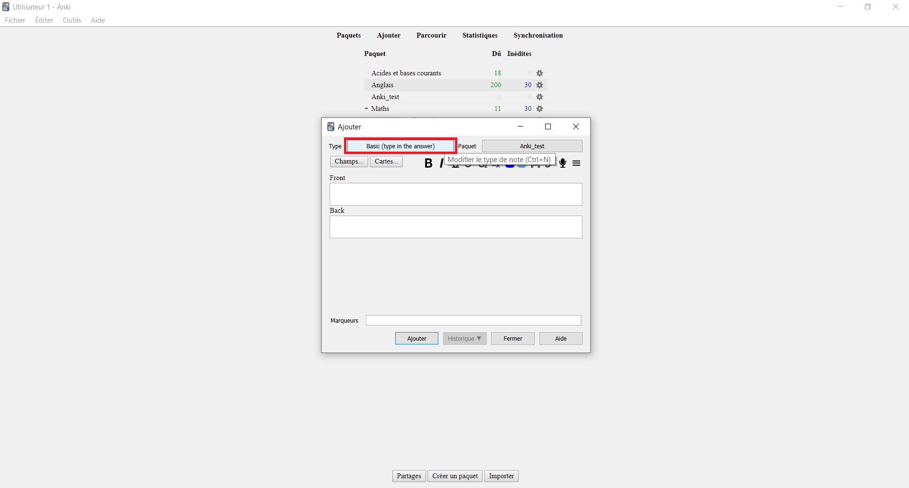

# Ankidroid

## About Anki

{: height="300" }

Anki is a free and open-source flashcard program.  As mentioned by the program name, which means “memorization” in Japanese, any user can **create a set of cards using text, images, sounds, videos and LaTeX** in order to learn or remember something.

For example, you can:
* learn a language, a computing language
* study for an exam, a subject
* memorize people’s names and faces
* study geography
* practice your vocal chords or guitar chords

## Why you should use it

||In my opinion, Anki is a program which makes remembering things easy.
Because it's a lot more efficient than traditional study methods.
For instance, if you have an exam in 1 week, you’ll begin to study it. If you study well, 
admittedly you’ll remember it for the exam, but maybe not after it.|

Whereas, with Anki, you benefit from **fast and long-lasting memorization** through space repetition. You can either greatly decrease your time spent studying, or greatly increase the amount you learn.

Moreover, with Anki, you have at your disposal many functionalities. **You can share flashcard packages**. You have access to statistics about your performances. And there are a large number of add-ons available.

Personally, I got used to using it during my 2 year undergraduate intensive course and I greatly increase my English skills from A1 to A2 maybe B1.

## How does it work

### o Ankidroid

|{: height="500" }|{: height="500" }|

Let me just introduce you a little add-on which is **Ankidroid**. Ankidroid is a phone application fully compatible with the software Anki by **synchronization (so you have to create an account)**.

It enables you to study all sorts of things wherever and whenever you want. Personally, I made good use of idle times on bus, train and subway during my 2 year undergraduate intensive course because it took me at least 1 hour to commute.

|{: height="500" }|{: height="500" }|

There are additional features like writing answers (which is optional, but I advice you to not use it… In my opinion, it’s more efficient to practice by yourself… Ankidroid is just a support).

|{: height="500" }|{: height="500" }|

You can edit or add cards, import shared packages and there is a whiteboard.

> If you prefer interaction rather than practice, then you can test **Memrise** (through gamified tests). But you'll just benefit from fast memorization...

### o Create a package in Anki

Go in `Add` (``Ajouter``) so you can create a cart.

But before, don’t forget to create a package.
You go here.

Then click `Add` (``Ajouter``) to create a package.
Let’s name it Anki-test.

Then you can create you cards.
What you type in `Front` is what will appear first. And when you click to show the answer, it will reveal what you type in `Back`.

There are different type of cards but the most commonly used are:
* `Basic cards`
* `Basic and reversed cards`
* `Basic (type in the answer)`

[Go back](../..)

+---------------+---------------+--------------------+
| Fruit         | Price         | Advantages         |
+===============+===============+====================+
| Bananas       | first line\   | first line\        |
|               | next line     | next line          |
+---------------+---------------+--------------------+
| Bananas       | first line\   | first line\        |
|               | next line     | next line          |
+---------------+---------------+--------------------+